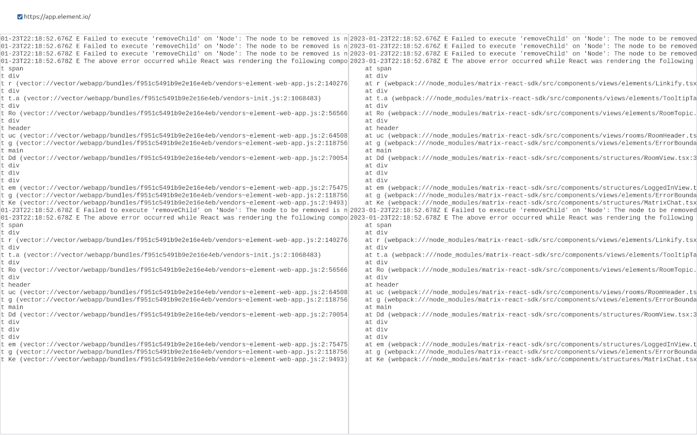

# JS Stacktrace decoder

All servers from which the stacktrace contains bundles are listed at the top as checkboxes.
Check them to trust that server for this session and load the corresponding bundles.

Below, a progress bar is shown if bundles are being loaded or decoded.

Below that, two textareas are shown. Paste the stacktrace in the one on the left, and you'll
get the decoded stacktrace in the one on the right.

## Available Scripts

### `npm start`

Runs the app. Open [http://localhost:3000](http://localhost:3000) to view it in the browser.

### `npm proxy`

Runs the CORS proxy for the app. Required to use the aforementioned app.
